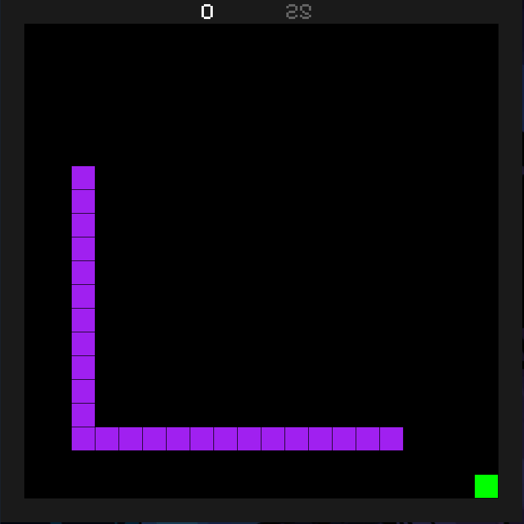

# Snake
*Ik it's a basic name but that is literally all it is*
## Why did I make it?
- This was for the Lonestar College Computer Science Club as both an example of what can be made using pygame.
- Also, the `basic_snake.py` file would be example for the club if they were to attempt to make their own snake game.
## How to Install
Copy the github repository
```git clone https://github.com/papatenko/snake```
Then run the main file using pythons
```python snake.py```
## Screenshots

## Controls
|Keystroke|Action|
|---------|-------|
|W or Up Arrow| Up|
|A or Left Arrow| Left|
|D or Right Arrow| Right|
|S or Down Arrow| Down|
